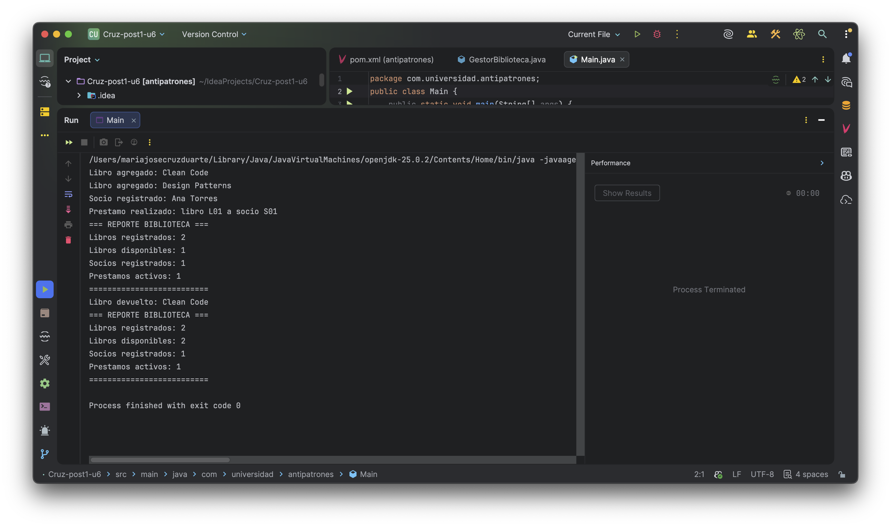
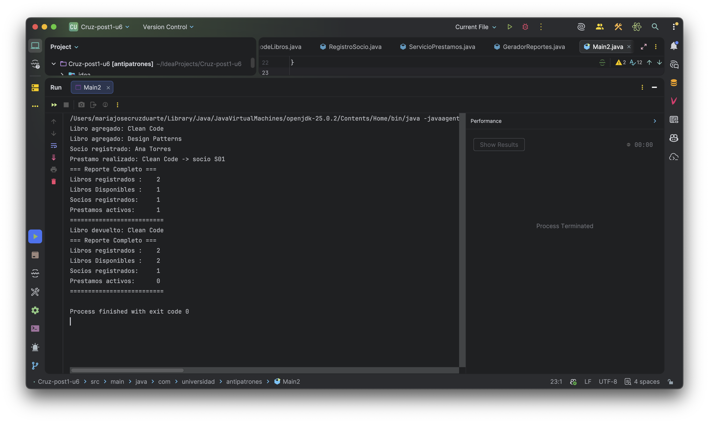

# Proyecto Biblioteca - Refactorización con SRP

## Antipatrón Identificado

El antipatrón identificado en el código original es **God Object**. Este antipatrón ocurre cuando una sola clase (en este caso, `GestorBiblioteca`) asume múltiples responsabilidades, violando el Principio de Responsabilidad Única (SRP). La clase `GestorBiblioteca` manejaba la gestión de libros, socios, préstamos y reportes, lo que la hacía compleja, difícil de mantener y propensa a errores.

## Responsabilidades Encontradas

Durante el análisis del código, se identificaron las siguientes responsabilidades que estaban mezcladas en la clase `GestorBiblioteca`:

- **Responsabilidad 1: Gestión del catálogo de libros** (agregar, buscar, listar)
- **Responsabilidad 2: Gestión de socios** (registrar, validar, buscar)
- **Responsabilidad 3: Gestión de préstamos** (prestar, devolver)
- **Responsabilidad 4: Generación de reportes del sistema**

## Patrón de Diseño Aplicado

Para resolver el antipatrón God Object, se aplicó el **Principio de Responsabilidad Única (SRP)**. Este principio establece que una clase debe tener una sola razón para cambiar, es decir, una sola responsabilidad. Como resultado, se refactorizó el código separando cada responsabilidad en clases dedicadas:

- `CatalogodeLibros`: Maneja la gestión del catálogo de libros.
- `RegistroSocio`: Maneja la gestión de socios.
- `ServicioPrestamos`: Maneja la gestión de préstamos.
- `GeradorReportes`: Maneja la generación de reportes.

Esto mejora la mantenibilidad, testabilidad y legibilidad del código.

## Capturas de la Ejecución

### Antes de la Refactorización

La ejecución antes de la refactorización utiliza la clase `GestorBiblioteca` (God Object) y produce la siguiente salida:

```
Libro agregado: Clean Code
Libro agregado: Design Patterns
Socio registrado: Ana Torres
Prestamo realizado: libro L01 a socio S01
=== REPORTE BIBLIOTECA ===
Libros registrados: 2
Libros disponibles: 1
Socios registrados: 1
Prestamos activos: 1
==========================
Libro devuelto: Clean Code
=== REPORTE BIBLIOTECA ===
Libros registrados: 2
Libros disponibles: 2
Socios registrados: 1
Prestamos activos: 1
==========================
```



### Después de la Refactorización

Después de aplicar SRP, la ejecución utiliza clases separadas y produce una salida similar pero con responsabilidades divididas:

```
Libro agregado: Design Patterns
Socio registrado: Ana Torres
Prestamo realizado: Clean Code -> socio S01
=== Reporte Completo ===
Libros registrados :    2
Libros Disponibles :    1
Socios registrados:     1
Prestamos activos:      1
==========================
Libro devuelto: Clean Code
=== Reporte Completo ===
Libros registrados :    2
Libros Disponibles :    2
Socios registrados:     1
Prestamos activos:      0
==========================
```


